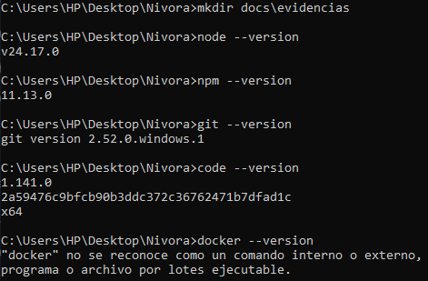
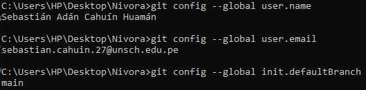
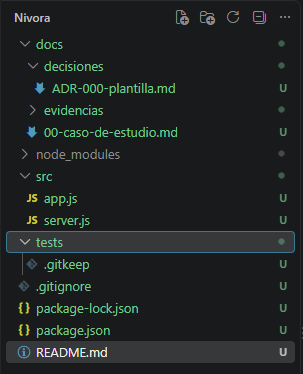

# Nivora

## Datos académicos

- **Estudiante:** Sebastián Adán Cahuín Huamán.
- **Asignatura:** IS-488 — Arquitectura de Software.
- **Docente:** Ing. Lizbeth Jaico Quispe.
- **Universidad:** Universidad Nacional de San Cristóbal de Huamanga.
- **Semestre:** 2026-II.

## Descripción del curso

El curso aborda la organización y estructura de los sistemas de software,
sus componentes y las decisiones que permiten atender requisitos de
seguridad, rendimiento, disponibilidad y mantenibilidad.

## Expectativas del estudiante

Espero aprender a estructurar un proyecto de software y justificar
sus decisiones arquitectónicas. También quiero mejorar el uso de Git
y GitHub para registrar los avances y mantener organizada la documentación
junto con el código.

## Proyecto

Este repositorio contiene los avances del proyecto Nivora para el curso
de Arquitectura de Software. Su documentación y código se desarrollarán
progresivamente siguiendo las guías de laboratorio.

## Entorno de desarrollo

| Herramienta | Versión o estado |
|-------------|------------------|
| Node.js | 24.17.0 |
| npm | 11.13.0 |
| Git | 2.52.0.windows.1 |
| Visual Studio Code | 1.141.0 — x64 |
| Docker | Pendiente de instalación |

## Dependencias instaladas

- **Express 5.3.0:** dependencia de producción para el servidor web.
- **nodemon 3.1.14:** herramienta de desarrollo para reiniciar el servidor.

## Revisión de dependencias

La ejecución de `npm audit --omit=dev` reportó cero vulnerabilidades
en las dependencias de producción.

Queda pendiente el seguimiento del aviso de seguridad de `braces`,
dependencia indirecta de nodemon.

Referencia: https://github.com/advisories/GHSA-vfj7-8cjw-p6xm

## Evidencias del laboratorio 01

### Verificación de versiones

### Configuración de Git

### Creación del proyecto y estructura base

